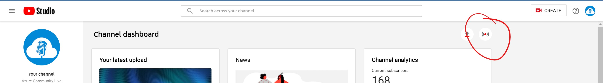
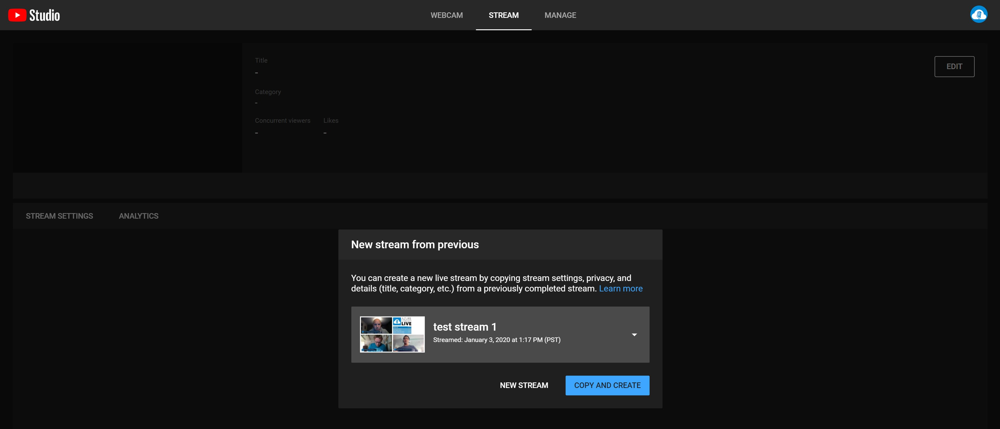
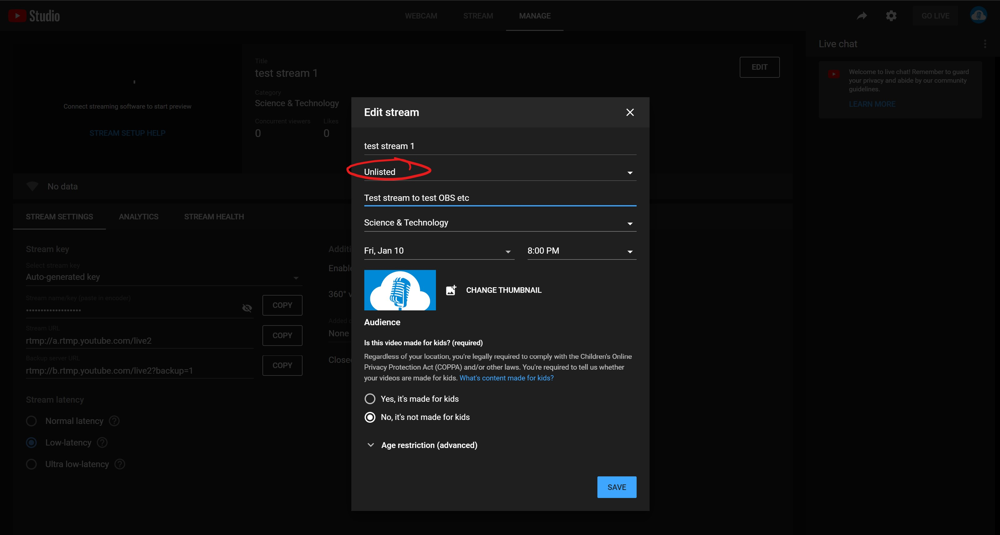
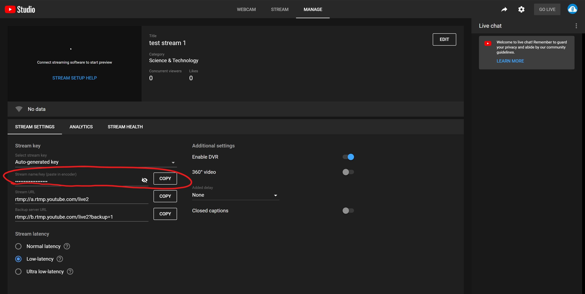
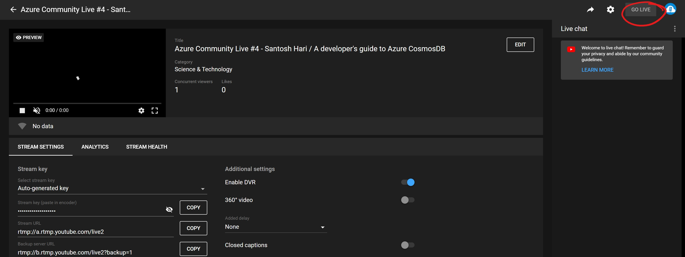

# streaming-setup
Setup for Azure Community Live hosts to stream

## Tools needed

install the following tools

- OBS Studio (https://obsproject.com/download)
- My stream timer (https://github.com/jamesmontemagno/MyStreamTimer)
- Skype, make sure you take the win 32 installer and NOT the windows store version (https://go.skype.com/windows.desktop.download)
- OBS Ndi plugin (https://obsproject.com/forum/resources/obs-ndi-newtek-ndi%E2%84%A2-integration-into-obs-studio.528/)

## Setup the tools

### Skype
in Skype you need to enable NDI -> howto: https://www.skype.com/en/content-creators/

### OBS
OBS Studio is the main tool to be used. Since OBS does not have any cloud storage like Streamlabs OBS we need to configure it on each PC of each host. Geert has created an initial set of Scenes and exported these. These + additional resources can be found on onedrive as a zip file called "streaming-resources.zip"

It's important to download and extract these files to c:\acl\ since the paths in the scenes are hardcoded paths and this way exporting and importing just works.

after all files are extracted open OBS studio, go to "Scene Collection" -> "Import" and select "acl scene collection.json"
you should now be able to select the scene collection and you are ready to stream

### YouTube

Before we can stream to YouTube we have to connect OBS to YouTube. OBS Studio does not have the fancy YouTube integration that Streamlabs OBS has, so we have to do some stuff manually.

First create a stream on YouTube.Com
- Go to YouTube.com and log in using the Azure Community Live account
- in the menu top right go to "YouTube Studio"
- top right click on "Go Live"

- create a new stream 

- make sure the stream is UNLISTED if you are testing things out

- copy the stream name/key

Open OBS Studio
- on the bottom right go to settings
- select stream 
- paste your stream name/key

Now you are ready to start streaming
- in OBS Studio click "Start Streaming" on the bottom right

> your stream won't be visible until you also GO LIVE on youtube. This gives you the chance to do some final checks if everything is working.

> Starting the stream 15 minutes before we actually starts helps get more viewers since youtube sends an email to all subscribers. since not everyone reads their email instantly they get the email 15 minutes before start.

- on Youtube stream management press GO LIVE (top right) as soon as you want to make the stream you are sending to youtube public

- ending the stream works on the same way as starting. press the END STREAM button (top right) where the GO LIVE button was
